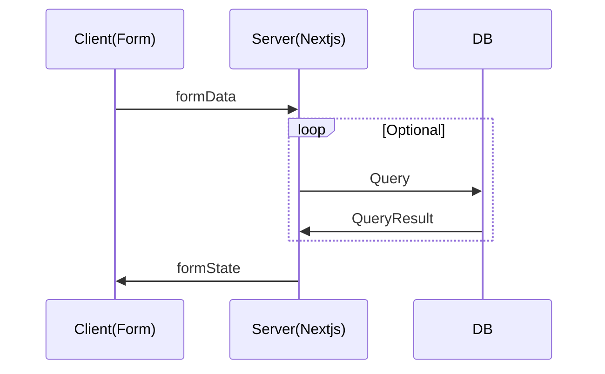

# Comments Auth App💬

This is a [Next.js](https://nextjs.org/) project bootstrapped with [`create-next-app`](https://
github.com/vercel/next.js/tree/canary/packages/create-next-app).

## Getting Started

First, run the development server:

```bash
npm run dev
# or
yarn dev
# or
pnpm dev
# or
bun dev
```

Open [http://localhost:3000](http://localhost:3000) with your browser to see the result.

## Stack

- Language: 
- Authentication: 
- Styling: 
- Deploy and Database:  [Vercel Postgres](https://vercel.com/docs/storage/vercel-postgres)
- Frontend and Server: 
- Validation: 
- ORM: 

## Features

| 메인                                                                                                    | 로그인                                                                                                                          | 댓글 작성                                                                                                         | 마이페이지                                                                                                                      |
| ------------------------------------------------------------------------------------------------------- | ------------------------------------------------------------------------------------------------------------------------------- | ----------------------------------------------------------------------------------------------------------------- | ------------------------------------------------------------------------------------------------------------------------------- |
|  |  |  |  |

## Sequence Diagram



### 1. Create the schema

Create a database table at `/drizzle/schemas.ts`

```typescript
export const usersTable = pgTable("users", {
  id: serial("id").primaryKey(),
  email: text("email").notNull(),
  password: text("password").notNull(),
});
```

### 1.5 migrate the schema using Drizzle

1. create a migration file

```bash
npx drizzle-kit generate
```

2. run the migration

```bash
npx drizzle-kit migrate
```

### 2. Create queries

Define the database queries to use in `/drizzle/queries.ts`

```typescript
export async function insertUser(data: InsertUser) {
  const result = await db.insert(usersTable).values(data).returning();
  return result[0];
}
```

### 3. Create `<form>` actions

Define the actions you want to associate with your form in `/lib/actions.ts`

```tsx
export async function action(
  state: FormState,
  formData: FormData
): Promise<FormState> {
  // 1. validate the form data
  //   1.1 if the form data is invalid, return the error as a form state
  // 2. preprocessing the data
  // 3. send the data to the server or database
  // 4. return the form state or redirect to another page
}
```

### 4. create and use the `<form>` components

Create a form wherever you want and attach actions to it using `useFormState` Track the progress of your form using `useFormStatus`

```tsx
import { useFormState, useFormStatus } from "react-dom";
export function AccountForm() {
  const [state, formAction] = useFormState(action, undefined);

  return (
    <form onSubmit={formAction}>
      <div>
        <input type="email" name="email" />
        <p>{state?.error?.email}</p>
      </div>
      <div>
        <input type="password" name="password" />
        <p>{state.error?.password}</p>
      </div>
      <p>{state?.message}</p>
      <SubmitButton />
    </form>
  );
}

function SubmitButton() {
  const { pending } = useFormStatus();
  return (
    <button disabled={pending}>{pending ? "Submitting..." : "Submit"}</button>
  );
}
```
